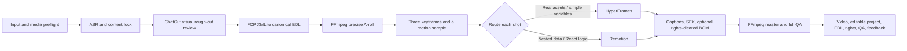

# AI Video Director Skill

[中文说明](README.zh-CN.md)

`ai-video-director` is a bilingual Codex Skill for governed AI video generation and talking-head editing. It coordinates content decisions, visual rough-cut review, one canonical timeline, deterministic media execution, shot-level visual routing, QA, editable delivery, and feedback memory.

This repository is private and intended for the owner's repeated real-world testing. Version `0.1.0` has passed the Skill schema check, six core regressions, a real FFmpeg synthetic-media render, Mermaid rendering, and the privacy scan. It does not yet grant a public-use license.

## How To Use

Attach the video, script, or supporting files to a Codex or other coding-agent task, then paste this prompt:

```text
Use the AI Video Director Skill from this repository to process my video:
https://github.com/yomage-ai/ai-video-director-skill

Handle Skill retrieval, environment checks, dependencies, project initialization, and tool setup yourself. Do not ask me to run installation commands.
Ask me briefly only when account login, system permission, payment approval, or media-rights confirmation genuinely requires my action.

First inspect my footage, script, and references. Then show me only:
1. A compact content-lock card;
2. A director plan;
3. Any essential missing information.

Do not start full production or consume paid credits before I approve. After approval, continue through rough cut, style preview, fine edit, QA, and editable delivery according to the Skill.
```

When the Skill is already available, the shorter form is enough:

```text
Use $ai-video-director to process this talking-head video. Inspect the material first, then show me the content-lock card and director plan.
```

The user supplies the material, target platform, and any important style request, then approves the key content, rough-cut, visual, cost/rights, and final-output gates. The Agent owns dependency checks, file organization, timeline conversion, rendering, and QA.

## Current Workflow



The process uses a renovation model: content lock is the construction drawing; A-roll and rough-cut timing are hard construction; B-roll, caption styling, motion, transitions, and sound are soft furnishing; QA and editable delivery are the completion archive.

## Active Decisions

- ChatCut is the visual rough-cut and human-review surface.
- ChatCut FCP XML is converted to one canonical EDL.
- FFmpeg stream copy is only for quick previews; precise re-encoding builds locked A-roll and the master.
- HyperFrames handles real-asset composition, fixed structures, and simple-variable shots.
- Remotion handles nested data, conditional layouts, and reusable React systems.
- Qwen3-TTS + MLX-Audio seed 42 is approved only for the recorded authorized reference and short Chinese samples; every output still requires ASR and listening review.
- Digital-human generation is paused. SadTalker is excluded and must not be used.
- BGM is off by default. Rights are checked per item and recorded.

The tested scope, current licenses, costs, privacy boundaries, strengths, failures, and excluded alternatives are recorded in [tool-selection.md](skill/ai-video-director/references/tool-selection.md). The eight public-case union and controlled component evidence are in [research-and-tests.md](skill/ai-video-director/references/research-and-tests.md).

ASR means automatic speech recognition: speech is converted into text with timestamps so cuts and captions can be checked against the recording. It proposes evidence; it does not replace full listening.

Private preferences are explicitly managed rather than silently learned. Feedback remains project-only until the user explicitly approves promoting it to the private base profile.

## Data Boundary

The repository stores the Skill, scripts, templates, governance records, and anonymous tests only. The Agent must keep footage, faces, voices, credentials, unpublished renders, project files, and personal preferences outside this Git repository.
