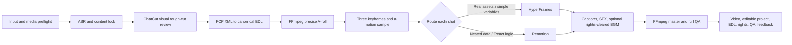

# AI Video Director Skill

[中文说明](README.zh-CN.md)

`ai-video-director` is a bilingual Codex Skill for governed AI video generation and talking-head editing. It coordinates content decisions, visual rough-cut review, one canonical timeline, deterministic media execution, shot-level visual routing, QA, editable delivery, and feedback memory.

This repository is private and intended for the owner's repeated real-world testing. Version `0.1.0` has passed the Skill schema check, six core regressions, a real FFmpeg synthetic-media render, Mermaid rendering, and the privacy scan. It does not yet grant a public-use license.

## Current Workflow



The process uses a renovation model: content lock is the construction drawing; A-roll and rough-cut timing are hard construction; B-roll, caption styling, motion, transitions, and sound are soft furnishing; QA and editable delivery are the completion archive.

## Active Decisions

- ChatCut is the visual rough-cut and human-review surface.
- ChatCut FCP XML is converted to one canonical EDL.
- FFmpeg stream copy is only for quick previews; precise re-encoding builds locked A-roll and the master.
- HyperFrames handles real-asset composition, fixed structures, and simple-variable shots.
- Remotion handles nested data, conditional layouts, and reusable React systems.
- Qwen3-TTS + MLX-Audio seed 42 is approved only for the recorded authorized reference and short Chinese samples; every output still requires ASR and listening review.
- Digital-human generation is paused. SadTalker is excluded and must not be used.
- BGM is off by default. Rights are checked per item and recorded.

The tested scope, current licenses, costs, privacy boundaries, strengths, failures, and excluded alternatives are recorded in [tool-selection.md](skill/ai-video-director/references/tool-selection.md). The eight public-case union and controlled component evidence are in [research-and-tests.md](skill/ai-video-director/references/research-and-tests.md).

## Install

Requirements: Git, Node.js 20+, npm, FFmpeg, and ffprobe. ChatCut, ASR, HyperFrames, Remotion, and local voice cloning are checked or activated only when their stage is used.

```bash
npm install
npm run doctor
npm run install-skill
```

Restart Codex after installation, then invoke:

```text
Use $ai-video-director to process this talking-head video.
Inspect the inputs first, then show me a compact content-lock card and director plan.
```

Initialize a project outside this repository:

```bash
npm run init-project -- --id my-video --root ~/Documents/ai-video-projects
```

ASR means automatic speech recognition: speech is converted into text with timestamps so cuts and captions can be checked against the recording. It proposes evidence; it does not replace full listening.

Private preferences are explicitly managed rather than silently learned:

```bash
npm run memory -- show
npm run memory -- record --project my-video --category captions --feedback "Use restrained caption motion"
```

Feedback remains project-only until an explicit promotion command records user approval.

## Data Boundary

The repository stores the Skill, scripts, templates, governance records, and anonymous tests only. Put footage, faces, voices, credentials, unpublished renders, project files, and personal preferences outside Git. Set `AI_VIDEO_DIRECTOR_DATA_DIR` for the private profile and feedback log.

Before committing:

```bash
npm test
npm run privacy-scan
```
