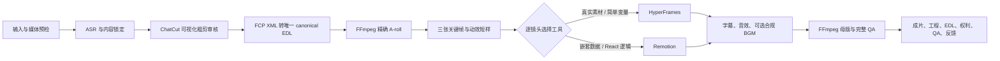

# AI 视频导演 Skill

[English](README.md)

`ai-video-director` 是一套支持中英文的 Codex Skill，用于组织 AI 视频生成和真人口播自动剪辑。它负责内容理解、粗剪审核、统一时间线、确定性媒体执行、逐镜头视觉工具选择、质量检查、可编辑交付和反馈记忆。

当前仓库保持私有，先供本人在不同 Codex 任务中反复实测。`0.1.0` 已通过 Skill 结构校验、6 项核心回归、FFmpeg 合成媒体实渲染、Mermaid 流程图渲染和隐私扫描。仓库暂未授予公开使用许可证。

## 怎么使用

把视频、文稿或其他素材附到 Codex 等 Coding Agent 的任务中，然后直接复制下面这段话：

```text
请使用这个仓库中的 AI Video Director Skill 处理我的视频：
https://github.com/yomage-ai/ai-video-director-skill

请自行完成 Skill 获取、环境检查、依赖准备、项目初始化和所需工具调用，不要让我手动执行安装命令。
只有遇到必须由我完成的账号登录、系统授权、付费确认或素材权利确认时，再简短询问我。

先检查我提供的视频、文稿和参考要求，然后只给我：
1. 一张简短的内容锁定卡；
2. 一份导演方案；
3. 当前缺少的必要信息。

我确认前不要完整制作或消耗付费额度。确认后按照 Skill 流程继续粗剪、风格预选、精剪、QA 和可编辑交付。
```

已经安装过 Skill 时，也可以直接说：

```text
使用 $ai-video-director 处理这条真人口播视频。先检查素材，再给我内容锁定卡和导演方案。
```

使用者只需要提供素材、目标平台和必要的风格要求，并在内容、粗剪、视觉方向、费用/授权和最终成片等关键节点确认。依赖检查、文件组织、时间线转换、渲染和质量检查由 Agent 自己完成。

## 当前流程



装修比喻：内容锁定是硬装施工图；A-roll 和粗剪时间线是硬装；B-roll、字幕样式、动效、转场和声音是软装；QA、可编辑工程和决策记录是竣工档案。

## 已确定的工具边界

- ChatCut：粗剪的多轨可视化和人工审核界面。
- ChatCut FCP XML：转换成后续唯一使用的 canonical EDL。
- FFmpeg `-c copy`：只做快速粗看；精确重编码负责锁定 A-roll 和母版。
- HyperFrames：真实素材编排、固定结构、简单变量和轻量批量镜头。
- Remotion：嵌套数据、条件布局和可复用 React 组件镜头。
- Qwen3-TTS + MLX-Audio `seed 42`：只批准当前授权参考声音的短中文样本；每条仍需 ASR 和人工听审。
- 克隆人/数字人：暂停。SadTalker 已排除，不得使用。
- BGM：默认关闭；开启后逐项核对商业许可并留档。

每个工具的已测范围、许可、费用、隐私、优缺点和排除项见 [工具选择](skill/ai-video-director/references/tool-selection.md)；八个公开案例的流程并集和单变量测试证据见 [研究与测试](skill/ai-video-director/references/research-and-tests.md)。

ASR 就是“把人说的话识别成带时间点的文字”。它帮助找口误、重说、字幕和剪点，但不能代替从头到尾听原声。

个人偏好不会被悄悄写成永久规则。反馈默认只用于本条视频；只有用户明确批准后，Agent 才会升级到私人基础档案。

## 数据边界

仓库只保存 Skill、脚本、模板、治理记录和匿名测试。Agent 必须把原片、脸、声音、密钥、未发布成片、项目工程和个人偏好放在 Git 外，不得提交到这个仓库。
