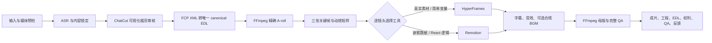

# AI 视频导演 Skill

[English](README.md)

`ai-video-director` 是一套支持中英文的 Codex Skill，用于组织 AI 视频生成和真人口播自动剪辑。它负责内容理解、粗剪审核、统一时间线、确定性媒体执行、逐镜头视觉工具选择、质量检查、可编辑交付和反馈记忆。

当前仓库保持私有，先供本人在不同 Codex 任务中反复实测。`0.1.0` 已通过 Skill 结构校验、6 项核心回归、FFmpeg 合成媒体实渲染、Mermaid 流程图渲染和隐私扫描。仓库暂未授予公开使用许可证。

## 当前流程



装修比喻：内容锁定是硬装施工图；A-roll 和粗剪时间线是硬装；B-roll、字幕样式、动效、转场和声音是软装；QA、可编辑工程和决策记录是竣工档案。

## 已确定的工具边界

- ChatCut：粗剪的多轨可视化和人工审核界面。
- ChatCut FCP XML：转换成后续唯一使用的 canonical EDL。
- FFmpeg `-c copy`：只做快速粗看；精确重编码负责锁定 A-roll 和母版。
- HyperFrames：真实素材编排、固定结构、简单变量和轻量批量镜头。
- Remotion：嵌套数据、条件布局和可复用 React 组件镜头。
- Qwen3-TTS + MLX-Audio `seed 42`：只批准当前授权参考声音的短中文样本；每条仍需 ASR 和人工听审。
- 克隆人/数字人：暂停。SadTalker 已排除，不得使用。
- BGM：默认关闭；开启后逐项核对商业许可并留档。

每个工具的已测范围、许可、费用、隐私、优缺点和排除项见 [工具选择](skill/ai-video-director/references/tool-selection.md)；八个公开案例的流程并集和单变量测试证据见 [研究与测试](skill/ai-video-director/references/research-and-tests.md)。

## 安装

基础环境需要 Git、Node.js 20+、npm、FFmpeg 和 ffprobe。ChatCut、ASR、HyperFrames、Remotion 与本地克隆声音只在对应环节启用和检查。

```bash
npm install
npm run doctor
npm run install-skill
```

安装后重新打开 Codex，再明确调用：

```text
请使用 $ai-video-director 处理这条真人口播视频。
先检查输入，再给我一张简短的内容锁定卡与导演方案。
```

在仓库外创建视频项目：

```bash
npm run init-project -- --id my-video --root ~/Documents/ai-video-projects
```

ASR 就是“把人说的话识别成带时间点的文字”。它帮助找口误、重说、字幕和剪点，但不能代替从头到尾听原声。

个人偏好不会被悄悄写成永久规则，而是显式记录：

```bash
npm run memory -- show
npm run memory -- record --project my-video --category captions --feedback "字幕动效克制一些"
```

反馈默认只用于本条视频；只有用户明确批准后，才会升级到私人基础档案。

## 数据边界

仓库只保存 Skill、脚本、模板、治理记录和匿名测试。原片、脸、声音、密钥、未发布成片、项目工程和个人偏好全部放在 Git 外。通过 `AI_VIDEO_DIRECTOR_DATA_DIR` 指定私人档案与反馈日志目录。

提交前运行：

```bash
npm test
npm run privacy-scan
```
