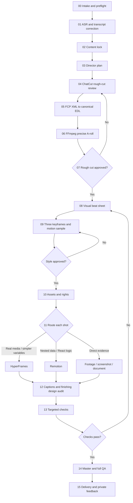

# Complete Workflow

## Mental Model

Treat the workflow like renovating a home:

- The content lock is the construction drawing.
- The recorded or approved synthetic voice and locked A-roll are the hard construction.
- B-roll, captions, motion, transitions, sound effects, and music are the soft furnishing.
- QA, editable sources, rights records, and decisions are the completion archive.

Changing soft furnishing is local. Changing the spoken content or cut points means returning to the relevant hard-construction stage and rebuilding everything downstream.

## Stage Graph

## Stages And Artifacts

| Stage | Plain-language action | Main tools | Required output/gate |
|---|---|---|---|
| 00 | Check whether the source can be handled without changing color, framing, timing, or audio unexpectedly | `ffprobe`, FFmpeg | `source-manifest.json`, review proxy only if needed |
| 01 | Turn speech into word-timed text, correct it against the recording, and listen through the source | ASR, ChatCut transcript, human listening | corrected transcript and word timing |
| 02 | Confirm what the video says | LLM plus user | one primary claim, at most two supports, order, real-evidence cold open |
| 03 | Decide what to remove, retain, prove, and visualize | director reasoning | approved director plan |
| 04 | Remove mistakes, repeats, dead sections, and bad takes while watching and listening; compare repeated takes quality-first, audit duplicate tokens across segment boundaries, classify pauses by function, and use the later take only as a tie-breaker | ChatCut | reviewed timeline, exact audio-window proof for changed word joins, `rough-cut-review.json` with take/join/coverage audit, and FCP XML |
| 05 | Convert the reviewed edit into one machine-readable timing truth | XML bridge | canonical EDL |
| 06 | Rebuild A-roll exactly from the best source | FFmpeg precise re-encode | A-roll master and captions aligned to it |
| 07 | Watch and listen from start to finish after the last cut change | media checks plus human | locked rough cut and canonical EDL version |
| 08 | Map each spoken section to evidence or a visual role | LLM plus real artifacts | visual beat sheet |
| 09 | Preview style cheaply before full production | HyperFrames or Remotion | three stills and one short motion sample approved by user |
| 10 | Collect only usable assets and record their rights | owned files, rights-checked libraries | asset list and rights manifest |
| 11 | Pick the simplest suitable engine for each shot | HyperFrames, Remotion, real media, FFmpeg | editable visual shots |
| 12 | Style captions; add a timing-locked semantic chapter progress strip or its single-bar fallback using the default edge-to-edge bottom line and divider-only chapter grammar; then explicitly audit, decide, and record background music, sound effects, entry/exit animation, transitions, and decorative effects, including reasoned `off`/`none` decisions | selected renderer, FFmpeg | caption layout, chapter-progress plan and composed-frame proof, finishing-design decision record, and any approved audio/motion treatment |
| 13 | Test the risky pieces, not the whole video | targeted renders and probes | audible changed-word windows, B-roll seam frames, caption pagination, layout/keyframe/transition/color checks |
| 14 | Render once checks pass, then inspect the whole result | renderer, FFmpeg, human review | master and QA report |
| 15 | Package editable sources and learn only approved preferences | archive and memory scripts | delivery package and feedback record |

## Return Rules

| What changed | Restart at | Invalidate |
|---|---|---|
| Spoken content, claim, order, or newly recorded material | 01 | content lock and everything after it |
| Deleted words, cut points, clip order, or audio joins | 04 | canonical EDL and everything after it |
| Visual direction, composition, palette, or motion behavior | 08 | visual work and everything after it |
| B-roll, screenshots, documents, or asset license | 10 | affected shots, downstream composite and QA |
| Caption style, effects, music, or mix | 12 | audio/caption output and final QA |
| Resolution, codec, HDR/SDR, or platform settings | 13 | master and delivery variants |

When source footage is described as supplementary, preserve the existing source map. Never interpret it as a whole-video replacement unless the user explicitly says so.

When a ChatCut duplicate or downstream working timeline uses a different frame rate from the locked canonical EDL, convert shared boundaries by time instead of copying frame numbers. Verify expected duration, first/last boundary, item count, order, and contiguity before any fine-edit work continues.
