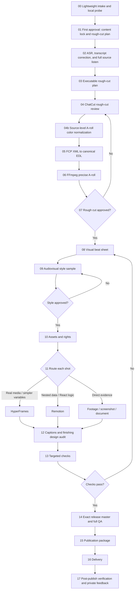

# Complete Workflow

## Mental Model

Treat the workflow like renovating a home:

- The content lock is the construction drawing.
- The recorded or approved synthetic voice and locked A-roll are the hard construction.
- B-roll, captions, motion, transitions, sound effects, and music are the soft furnishing.
- QA, editable sources, rights records, and decisions are the completion archive.

Changing soft furnishing is local. Changing the spoken content or cut points means returning to the relevant hard-construction stage and rebuilding everything downstream.

## Stage Graph

## Stages And Artifacts

| Stage | Plain-language action | Main tools | Required output/gate |
|---|---|---|---|
| 00 | Lock only the inputs needed for the first decision: platform, aspect ratio, source identities, supplied-manuscript reliability, rights/privacy blockers, and local media facts. Do not upload large media, retry a cloud import, render style, or research publication details before the first approval unless one of those actions is genuinely needed to understand the content | local file inspection, `ffprobe`, supplied manuscript, selective source orientation | lightweight intake and first-approval work-budget decision |
| 01 | Present a plain-language card in the user's language that locks the core claim, must-keep content, removable content, order, rough-cut rhythm target, and uncertainties. Do not expose machine JSON. Do not ask the user to approve a visual style that has not been demonstrated | LLM plus user | approved content lock and rough-cut plan |
| 02 | After first approval, turn speech into word-timed text, correct it against the recording, and listen through the complete source before cutting | ASR, ChatCut transcript, human listening | corrected transcript, word timing, and source-listen record |
| 03 | Convert the approved content decision into executable selections, alternate-take decisions, expected joins, and early/middle/late pace windows | director reasoning | executable rough-cut plan |
| 04 | Remove mistakes, repeats, dead sections, and bad takes while watching and listening; compare repeated takes quality-first, audit every real placed-item join at normal speed, classify pauses by function, compare early/middle/late speaking pace, apply only stable pitch-preserving retime when justified, use the later take only as a tie-breaker, then normalize original A-roll color once at source/track/global scope and roll back with a stage update if it drifts | ChatCut, decoded-frame comparison, `audit-rough-cut-review.mjs` | reviewed timeline, a complete fail-closed `rough-cut-review.json`, exact audio-window proof for every real join, pace and pause decisions, source-color proof, and FCP XML |
| 05 | Convert the reviewed edit into one machine-readable timing truth | XML bridge | canonical EDL |
| 06 | Rebuild A-roll exactly from the best source | FFmpeg precise re-encode | A-roll master and captions aligned to it |
| 07 | Watch and listen from start to finish after the last cut change; approve the source-level color decision | media checks plus human | locked rough cut and canonical EDL version whose A-roll color fine edit must inherit |
| 08 | Map each spoken section to evidence or a visual role; classify each aggregate run as `A-only`, `B-only`, or `AB-live`, choose the layout family separately for `AB-live`, and propose chapter labels, order, one-sentence scopes, and any recurring signature-outro candidate | LLM plus real artifacts | visual beat sheet, coverage-run plan, and semantic chapter proposal |
| 09 | Preview the fine-edit direction only after rough-cut lock unless an exact approved private profile or reference already exists. Resolve the style source in order: exact approved reference, explicit user style/reference, public curated style, then dynamic adaptation after at least two curated candidates are assessed with rejection or borrowing reasons. The public library preserves liked, used, approved, and marked references but is not a closed asset whitelist. When no entry is a complete match, define one dominant visual/audio system and a beat-level plan for real evidence, generated or code-authored material, typography, icons, footage, music, and SFX. Use a `6-12 s` audiovisual sample with real dialogue, captions, the planned asset/evidence treatment, presenter treatment when relevant, and the proposed BGM/SFX state | curated style registry, dynamic adaptation contract, HyperFrames, Remotion, real media, `audit-fine-edit-direction.mjs` | audited style-source decision, asset plan, audiovisual system sample, and user approval |
| 10 | Collect only usable assets and record their rights | owned files, rights-checked libraries | asset list and rights manifest |
| 11 | Pick the simplest suitable engine for each shot; when `B-base-A-cutout` is selected, preprocess the clean locked A-roll with governed HyperFrames background removal and retain canonical audio separately | HyperFrames, Remotion, real media, FFmpeg | editable visual shots and any time-aligned transparent presenter derivative |
| 12 | Preserve the approved caption style unless the user explicitly changes it. For portrait short-form captions, start with one semantic line per card; use two lines only when one line would force tiny type, over-fast card changes, harmful semantic fragmentation, or conflict with an exact approved reference, and record the reason. Keep progress labels separate from captions, apply the approved progress component or generic fallback, synchronize any approved signature outro, verify inherited A-roll color, and fail closed on cutout matte defects. For portrait `B-base-A-cutout`, start with lower-left and lower-right placement candidates and outline `on`, then choose the side, color, width, and any override from content occupancy, the approved reference, platform controls, and the built-in Xiaoxiong style or explicit local overrides. These public recommendations are overridable, not style locks. Allocate screen source ranges across the whole story before full authoring, state what each run adds, and justify exact range reuse. Map every major hook, proof, number, turn, punchline, and conclusion to a reasoned `none`/visual/audio/both decision. Use one primary evidence plane by default; do not persistently duplicate the same screen in synchronized top/bottom regions. Explicitly audition, decide, and record background music, sound effects, entry/exit animation, transitions, and decorative effects; `off`/`none` is a reasoned result, not a silent default. For enabled BGM/SFX, record creator-facing origin, provider/library, rights item, applicable generation id, and originality limits | selected renderer, FFmpeg | caption-layout proof, cross-run evidence-source allocation, evidence-composition proof, narrative-emphasis proof, chapter-progress proof, cutout matte/placement/outline proof when applicable, signature-outro proof when applicable, finishing-design record, audio-provenance record, and approved audio/motion treatment |
| 13 | Test the risky pieces, not the whole video | targeted renders and probes | audible changed-word windows, B-roll seam frames, caption pagination, layout/keyframe/transition/color checks |
| 14 | Read the release-render operations guide for memory-intensive output, test a short exact-resolution sample, run only one observable heavy render with a conservative resource mode, then inspect the exact whole result. After a resource failure, preserve evidence and materially change the strategy rather than raising only the JavaScript heap or starting background retries | renderer, FFmpeg, `references/release-render-operations.md`, human review | exact release candidate, reproducible resource-safe command, probe, full decode, QA report, and user approval on that file |
| 15 | Verify current official rules, resolve a claim-evidence record for every numeric or measurable publication claim, and build several accurate cover-title, caption, hashtag, campaign-tag, and AI-disclosure choices from the approved release candidate | official platform/regulator sources, `audit-publish-package.mjs` | dated `publish-package.json`, resolved claim ledger, and selected or alternate publication variants |
| 16 | Package editable sources, write an absolute-path delivery manifest, and classify every lesson by change type and promotion layer | archive and memory scripts | openable project, `delivery-manifest.json`, `learning-scope-ledger.json`, and delivery package |
| 17 | When publication follow-through is in scope, record the direct item, visibility, processing/review/public state, other-account check, and explicit platform notice before diagnosing or reposting; then route explicitly shared style updates to the public profile, identity treatments to the selected identity Skill, and unshared overrides/history to local memory | live platform status and memory scripts | post-publish status record and feedback record |

## Return Rules

| What changed | Restart at | Invalidate |
|---|---|---|
| Spoken content, claim, order, or newly recorded material | 01 | content lock and everything after it |
| Deleted words, cut points, clip order, or audio joins | 04 | canonical EDL and everything after it |
| Original A-roll exposure, white balance, or natural-skin normalization | 04 | precise A-roll, rough-cut approval, and every downstream visual/QA artifact |
| Visual direction, composition, palette, or motion behavior | 08 | visual work and everything after it |
| B-roll, screenshots, documents, or asset license | 10 | affected shots, downstream composite and QA |
| Caption style, effects, music, or mix | 12 | audio/caption output and final QA |
| Resolution, codec, HDR/SDR, platform settings, or source-quality requirement | 00 when the composition is affected; otherwise 13 | release candidate, QA, publication package, and delivery variants |
| Final content, public/open-source status, campaign eligibility, or platform rule changed | 15 | publication copy, tags, disclosures, and upload settings |

When source footage is described as supplementary, preserve the existing source map. Never interpret it as a whole-video replacement unless the user explicitly says so.

When a ChatCut duplicate or downstream working timeline uses a different frame rate from the locked canonical EDL, convert shared boundaries by time instead of copying frame numbers. Verify expected duration, first/last boundary, item count, order, and contiguity before any fine-edit work continues.

## Executable Entry / 当前执行入口

Use [execution-and-evidence.md](execution-and-evidence.md) for stage commands, binding, approvals and migration. The graph describes editorial order; pipeline receipts bind real versions. The rough candidate is rendered before its own audit, while fine-render and delivery are gated. Read `production-standard.md` at rough/fine execution, not as a prerequisite to a lightweight content card.

阶段图表达剪辑顺序，实际入口按文件哈希绑定。先生成粗剪候选再听审，精剪和交付必须经过门禁；轻量内容卡不先背完整生产规范。
